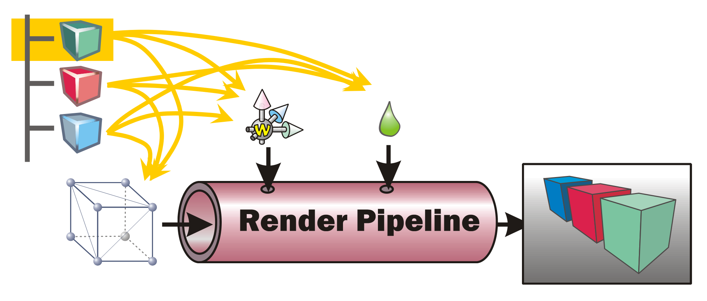
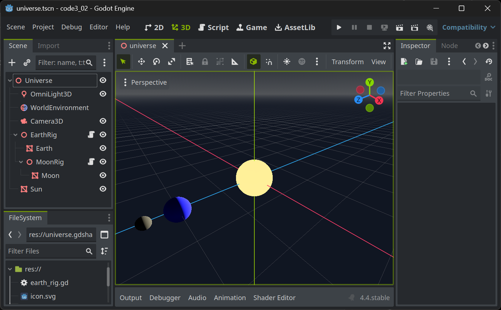
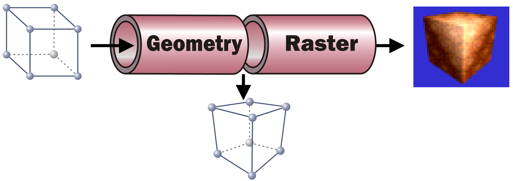
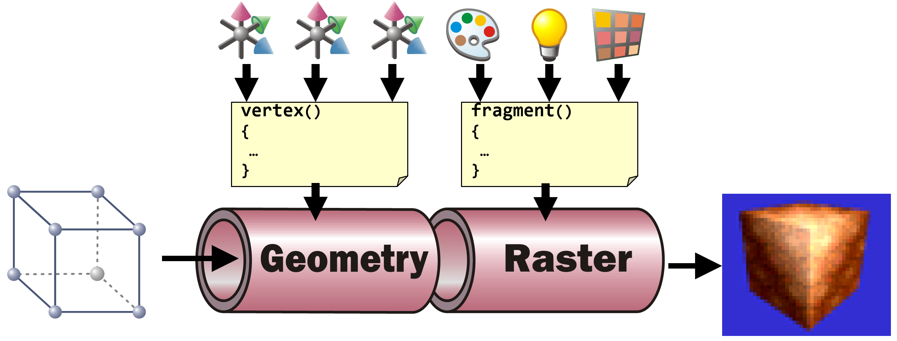

+++
title = 'Introduction to Rendering and Shaders in Godot'
draft = false
weight = 70
+++

## The Rendering Pipeline

In order to render a picture from the data contained within the scene tree (or scene graph) in a game engines such as Godot, all data needs to be prepared and presented to the rendering pipeline. This is done by _traversing_ the scene graph. During this process, each node within the scene is visited once and all the data it contains is sent to the rendering pipeline. A typical scene graph traversal is performed _"depth first"_, that is, whenever a node with children _and_ siblings is currently visited, the next step will be to _first_ visit its list of children and _then_ continue with its next sibling.



Information such as the transformation (position, rotation, scale) as well as material settings are used to control the state of the rendering pipeline. The geometry (the meshes) present at the various scene nodes is directly "pumped" through the pipe. The pipeline's task is then to generate a pixel image out of the geometry under the various current settings (also called the _render state_).

> ### 🪛 TODO
>
> Imagine (or better, generate) a scene with hierarchies (such as a simple solar system) and perform a depth-first traversal with pen and paper. In which order are the scene nodes visited? 
>
> 
> 

### Render Pipeline Sub Processes

While this task can be broken down in quite a number of individual steps, each performed one after the other, we will only look at two sub-processes performed within the rendering pipeline here:



1. The **Geometry** part takes each incoming vertex with its (x, y, z) coordinates present in _Model Space_ (the coordinates that the vertex was assigned when it was modeled, e. g. in Blender's Edit Mode). It then converts the vertex' coordinates into _Screen Space_. To to this, it applies all transformations present in the path from the scene root to the model. In addition it performs the (inverted) camera transformation. As a result, the vertex new coordinates are then in screen space, allowing to identify the pixel in the resulting image where the respective vertex will be positioned.
    > ### 🪛 TODO
    >
    > In the above solar system example, what transformations must be applied to all vertices of the Moon mesh?
    >
    As the information which vertices span which triangles do not change, after the Geometry step each triangle of the geometry can be "placed" on the to-be-generated pixel image.

2. With the knowledge which pixels in the resulting pixel images will be covered by which triangle, each of these pixels can now be assigned a color. This is the task of the **Raster** part. For each pixel a color calculation is performed, typically taking into account the pixel's Normal (where the mesh surface at the given screen pixel is "looking at"), the lighting situation (where is light coming from? In which intensity and color?), the material's base color (its albedo) and/or, if present, the texture(s) to use for the material, the texture coordinate (UV) and possible vertex colors present at the screen pixel in question. For any of that information only present at the mesh's vertices (such as normal, UV, vertex colors...), a weighted average is calculated for the pixel based on the distance of the pixel to the containing triangle's vertices. All the pixel-related information present as an input to calculate an individual pixel are called a **Fragment**.

## Shaders in Game Engines

In game engines, the exact operations to be performed to transform each vertex in the Geometry part and to calculate each fragments resulting pixel color are described in the materials stored in the scene graph. When using standard materials (such as in Godot), the shader code to use is defined by the engine. All a user has to do is to set the parameters (the transformations on each node as an input to the vertex shader and the various material settings such as albedo, transparency, roughness, emissive, ... as input to the fragment shader).

Most engines allow users to define their own shader code together with their own set of shader parameters. In addition, most engines allow shader authors to access the standard shader input variables such as transformations given by the scene hierarchy and their transformations, the light settings, etc.



### Shaders in Godot

Godot users can define their own shaders using a [`ShaderMaterial`](https://docs.godotengine.org/en/stable/classes/class_shadermaterial.html). This type of resource can be applied everywhere, where a material can be set, e.g. in the material setting for a mesh's surface.

A ShaderMaterial must be given the file name of the shader code (with the ".gdshader" extension). When creating a new shader code file, an empty shader is created.

```cpp
shader_type spatial;

void vertex() {
	// Called for every vertex the material is visible on.
}

void fragment() {
	// Called for every pixel the material is visible on.
}

```

Although both, `vertex` and `fragment` shaders contain an empty implementation, the shader already performs vertex transformation according to the scene settings and a simple pixel color calculation.

To switch off the vertex transformation, add 

```cpp
render_mode skip_vertex_transform;
```

to the top of the shader.

To switch off any color calculation, add 

```cpp
render_mode unshaded;
```

to the top of the shader.

> ### 🪛 TODO
> 
> Read the Godot Shader documentation and toy around with some simple shader settings.
>
> In the vertex shader (with `skip_vertex_transform` set), implement your own vertex transformation by multiplying each vertex and normal with the **ModelView** matrix:
> ```cpp
> VERTEX = (MODELVIEW_MATRIX * vec4(VERTEX, 1.0)).xyz;
> NORMAL = normalize((MODELVIEW_MATRIX * vec4(NORMAL, 0.0)).xyz);
> ```
>
> Add a fraction of the normal to the vertex resulting in the geometry appearing thicker or thinner depending on how big the fraction is.
>
> In the (`unshaded`) fragment shader, set the resulting color of the current fragment/pixel by applying a threedimensional color (rgb, e.g. green: (0, 1, 0)) value scaled by the angle between a light direction directly from the current camera's viewing direction and the fragment's normal to the **Albedo**
>
> ```cpp
> ALBEDO = vec3(0, 1, 0) * dot(vec3(0, 0, 1), NORMAL);
> ``` 
>
> Make the parameters such as the "thickness" used in the vertex shader or the base color or even the light direction in the fragment shader [`uniform`](https://docs.godotengine.org/en/stable/tutorials/shaders/shader_reference/shading_language.html#uniforms) variables and see how they can be controlled within Godot's User Interface.


