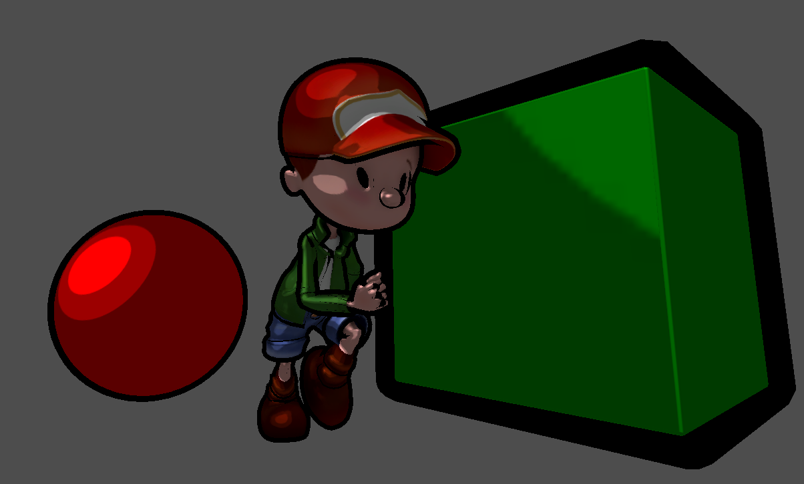
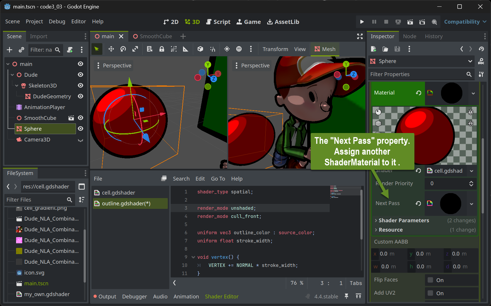
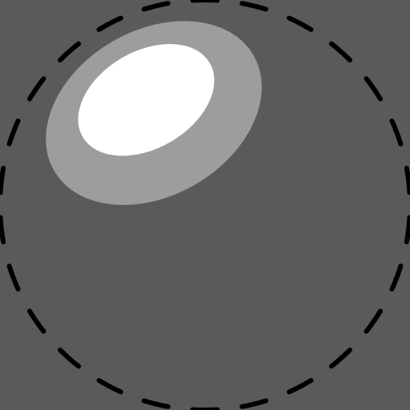
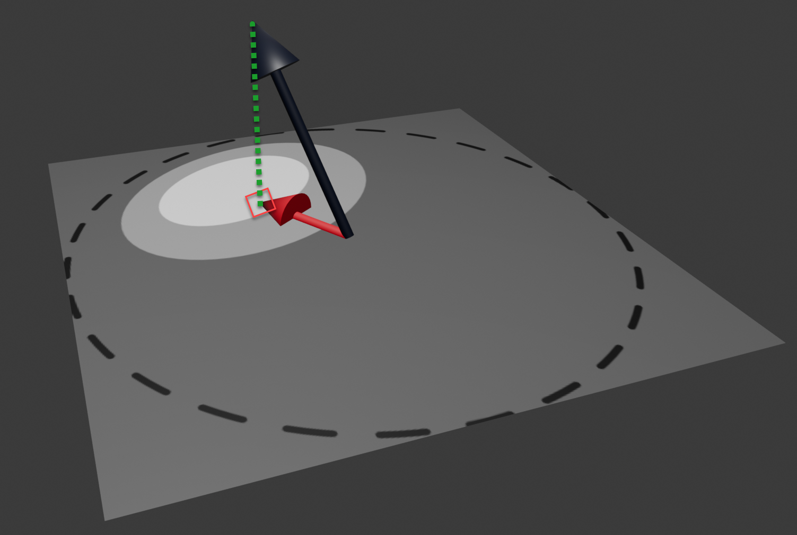

+++
title = 'Toon Shading'
draft = false
weight = 80
+++



## Multipass Rendering

In Real-Time rendering many visual effects result from a combination of the same mesh being passed through the rendering pipeline more than once with each of these passes having a different shader performing the rendering. 

To simulate the impression of a hand-drawn image in comic-book-style, we can combine two render passes.


1. The first pass (cell pass) renders the geometry with usual transformation (no other than the transformation performed in Godot's standard vertex shader). In the fragment shader, the object's base color (either one color for the entire object or a color looked up from a texture accompanying the model) is shaded (darkened) in one of a very small number of discrete different brightness levels (e.g. three: light, medium, dark). This simulates the effect how a comic painter tries to visualize lighting: lacking a huge number of differently shaded color pencils for each color, they will draw the cell-like impression with hard transitions from one brightness level to the next.

2. The second pass (outline pass) inflates the geometry in the vertex shader using the "normal-trick" from the last lesson. The result is entirely painted in black (or a user-defined color) in the fragment shader. This will generate the dark outline around the objects.

It might have sounded more intuitive to first mention the outline pass and then the cell pass, because the color is somewhat expected to paint over the inflated black silhouette, we will find out that it does not play a role in which order the passes are performed since making the cell-colored pixels replace the black outline will be realized purely by having the colored geometry being placed in front of the black inflated geometry within 3D space. Let's find out how this is accomplished:


## Multipass Rendering in Godot

Setting up multipass rendering in Godot is easy: Each `ShaderMaterial` resource allows to have a `Next Pass` property set. Simply assign another ShaderMaterial to that and you have the geometry associated with the outer ShaderMaterial travel twice through the rendering pipeline.



## The Outline shader

Implementing the outline shader is straightforward. The vertex shader is configured to perform the standard transformation (**NO** `render_mode skip_vertex_transform`!!). The code blows up the geometry by adding a fraction of the normal to each vertex. The amount of this fraction will then become the stroke width and can be set by users when implemented as a `uniform`.

The fragment shader is even simpler: With `render_mode unshaded` set, no lighting calculation at all is performed. Instead, each pixel is assigned the same color. Preferably black or dark colors will generate the comic-bookish outline look .

```glsl
shader_type spatial;

render_mode unshaded;
render_mode cull_front;

uniform vec3 outline_color : source_color;
uniform float stroke_width;

void vertex() {
	VERTEX += NORMAL * stroke_width;
}

void fragment() {
	ALBEDO = outline_color;
}
```

The most interesting part is the solution to how the black pixels of the silhouette are positioned _behind_ the colored pixels from the cell pass. This is done by painting only the "rear-sided" triangles - those which are facing away from the camera. This way the (rather) concave inside of a half shell of the geometry is painted in black which will then be filled with the colored geometry. To achieve this, the cull mode which normally culls all triangles facing away from the viewer is reverted by the statement `render_mode cull_front` at the top of the shader.

## The Cell Shader

To achieve the cell like look, we need to map the direction a pixel is looking at in 3D space (its normal) to one of the available brightness levels. There are many ways how this can be accomplished. We will use a 2D lookup table that's easy to create and in addition gives us some creative headroom to define the look.

We create the 2D lookup table as a 2D pixel image that will be used as a texture in the cell pass' fragment shader. Using an image painting program, we can paint a comic-like (cell-shaded) sphere. Typically one would draw a highlight using nested cells with increasing brightness at some upper left or right part of the sphere. 



The sphere itself is not displayed as it is better to fill the entire square texture with the lowest brightness level. To generate the image, draw a helper circle (or imagine one) fitting exactly into the square texture and make sure not to paint any brightness highlights outside that circle. Make sure to **NOT** export that helper circle (the dotted line in the above image) to your shader texture. We will call this texture the _gradient_.

In the cell pass' fragment shader we can use the normal at the to-be-rendered pixel to select which of the brightness cells should be used by projecting the normal onto the gradient texture and use the brightness of the texture pixel found there.



The black normal in the above image is (by calculation) positioned in the middle of the gradient texture and scaled to not exceed the gradient texture even when it would be in the image plane itself. Then it is projected (green dotted line) onto the image yielding texture coordinates to look up the pixel in the gradient texture. The (gray scale) color found there is used to multiply (shade) the object's base color.


```glsl
shader_type spatial;
render_mode unshaded;

uniform vec3 albedo : source_color;
uniform sampler2D tex : source_color;
uniform sampler2D gradient : source_color;

void vertex() {
}

void fragment() {
	vec3 cell = texture(gradient, vec2(0.5, -0.5) * NORMAL.xy + vec2(0.5, 0.5)).rgb;
	vec3 tex_col = texture(tex, UV).rgb;
	ALBEDO = albedo * tex_col * cell;
}
```

The shader accomplishing this has nothing to do in the vertex shader (other than the standard shader would do). The texture lookup in the gradient with the scaled and translated normal yields the `cell` gray scale color value. This is then combined with a given overall base color (`albedo`) and any given color texture associated with the object using a texture lookup with the `UV` coordinates averaged from the UVs provided at the mesh's vertices.